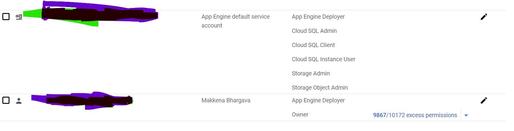
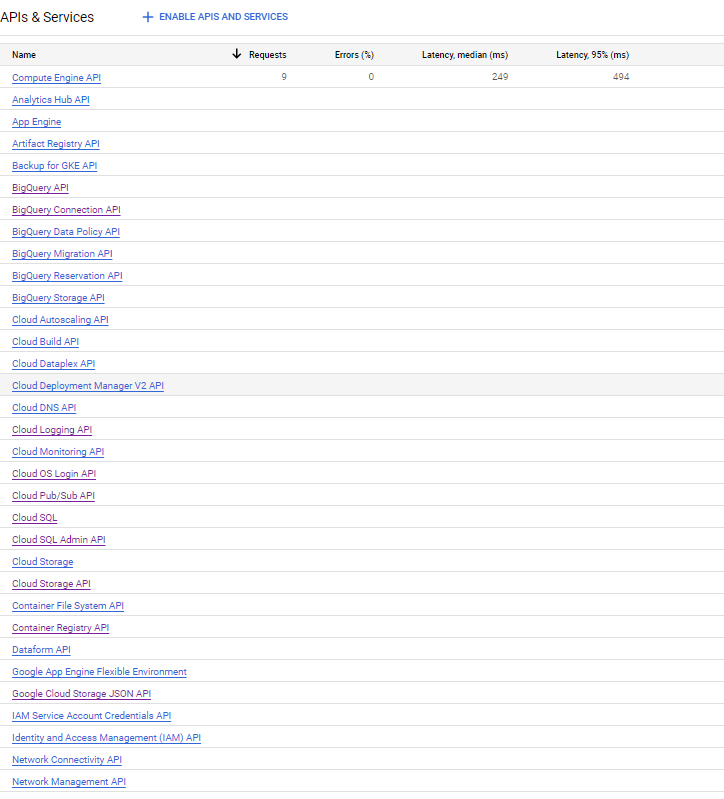

# Auth2
Auth2.0 using Azure and GCP deployment

# Redis setup on windows:
Please visit https://github.com/microsoftarchive/redis/releases

# Kafka Setup on windows
Please visit https://kafka.apache.org/downloads
1. Download the binaries from above website(i.e scala 2.12 or 2.13)
2. start the zookeeper and broker separately using batch and properties in the command prompt
3. or if you have docker on your machine you can directly run kafka by using Confluent ready-made images 

# Azure Oauth registration :
1.Login to portal.azure.com

2.Search App Registration.

3.Click new registration and give App name.

4.Add platform as Web and give redirect URL and complete registration.

5.Go to the overview and copy the both client id and tenant id.

6.Create a Client secret by clicking on certificates and secrets and copy the secret value.

7.Open API permissions and add a new permission by choosing azure service management and select user_impersonation and save it.

# GCP Configuration
1. Create one free Google cloud account by visiting https://console.cloud.google.com
2. Create one new application as per your naming conventions
3. Create App Engine for the application deployment
4. If your application requires Cloud Database , Create one SQL instance and setup user and privileges
5. Open IAM and assign roles for both User and service account for seamless deployment
    
6. For the Sql connections from App Engine we should whitelist the following IP's in the cloud SQl in the GCP networking ->
   **public Ip (0.0.0.0/0)(not recommended for production) ,
   AppEngineAccess (199.36.153.4/30)**
7. Enable the following api's for seamless deployment and application run
  

# Deployment Process
1.Install Google Cloud SDK shell on your machine

2.Build your Application Jar and copy the Jar from target folder to Application parent folder where app.yaml exists

3.In the Google Cloud SDK shell use the **gcloud init** command and select your application which you created earlier in gcp and select the region for app deployment

4.Now open the new command prompt and switch application directory and run the **gcloud app deploy** command

5.If there are any errors during the deployment ,it will show in the command prompt

6.For Cloud application build details you can check at https://console.cloud.google.com/cloud-build/builds

7.For artifacts and docker images related you can check at https://console.cloud.google.com/artifacts/docker

8.For the Application logs you can visit https://console.cloud.google.com/monitoring/dashboards

# Note:

1.Your application should run on port 8080 as GCP app engine checks readiness and liveness on 8080

2.Use Java17 and Spring boot 3.X.X for seamless deployments

# there you go 😂😂😂

